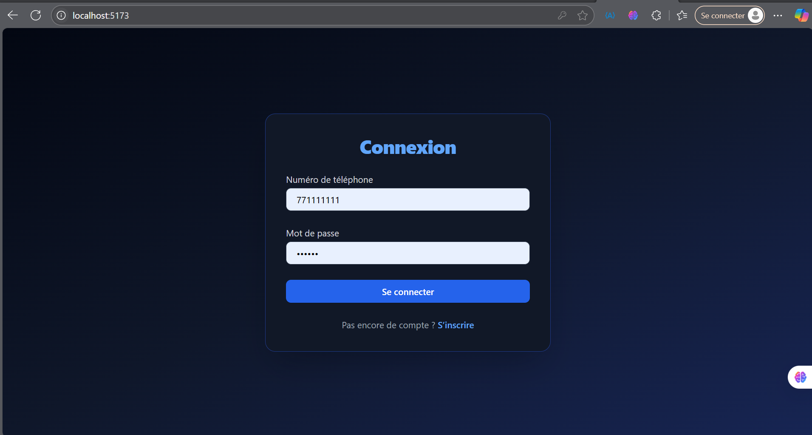
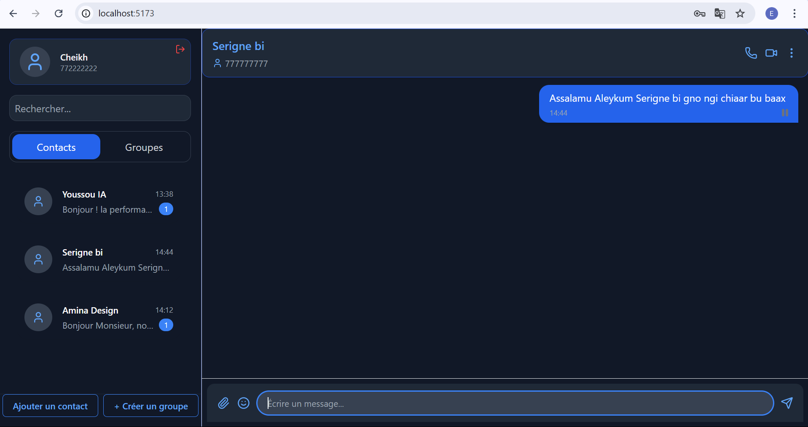
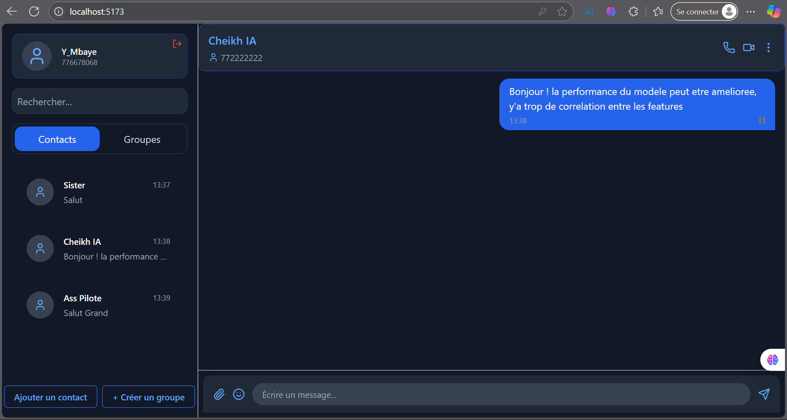
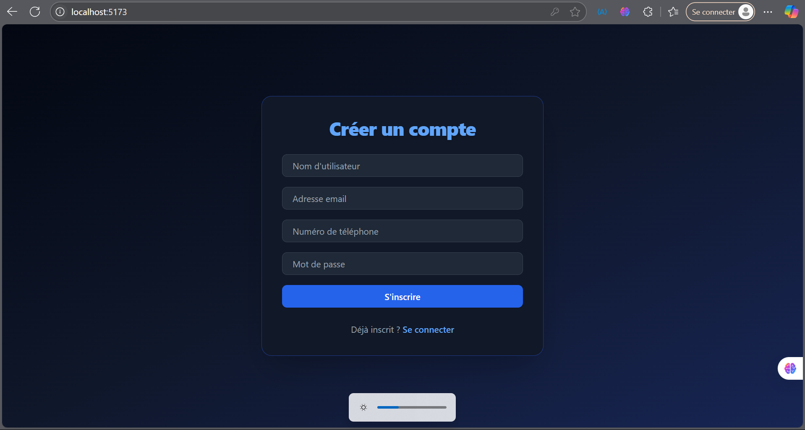
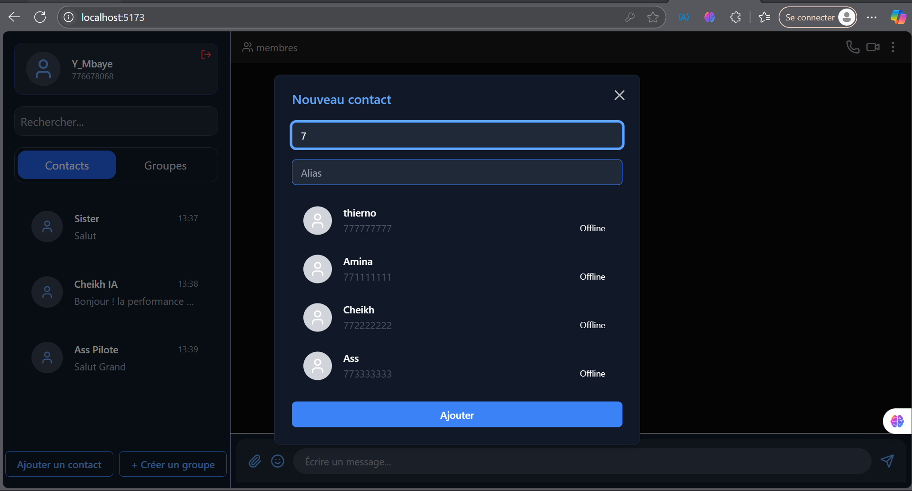
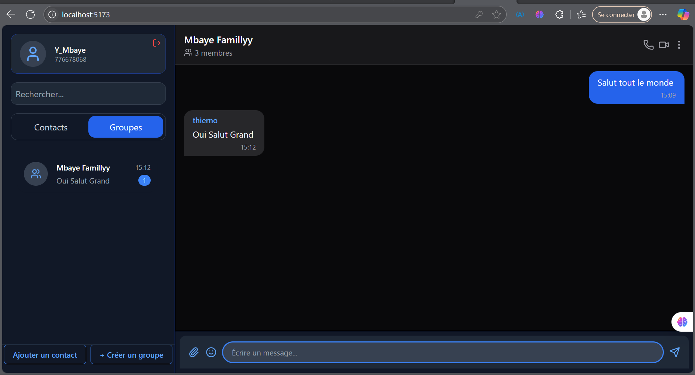

# 📱 Colab — Application de Messagerie Instantanée

Colab est une application de messagerie instantanée moderne, inspirée de WhatsApp, développée dans un objectif pédagogique. Elle intègre une communication en temps réel via WebSocket, une interface utilisateur élégante avec React, et un backend en Java Spring Boot utilisant des fichiers XML pour la persistance des données.

> ⚠️ Le code source est privé. Pour toute demande d'accès, merci de me contacter directement.

---

## 🎯 Objectif du projet

Ce projet a été conçu pour consolider mes compétences en :
- 📡 communication en temps réel (WebSocket, STOMP)
- 📁 manipulation de données semi-structurées (XML avec JAXB)
- ⚙️ développement frontend moderne avec React & Tailwind CSS
- 🧩 structuration d’un projet fullstack (React + Spring Boot)

Il a été réalisé juste après un module universitaire sur les **données semi-structurées**, d'où l'utilisation volontaire de XML plutôt que d'une base de données classique.

---

## ✨ Fonctionnalités principales

### 👤 Gestion des utilisateurs
- Inscription, connexion
- Gestion du profil

### 💬 Messagerie en temps réel
- Envoi et réception de messages instantanés (WebSocket)
- Autoscroll, mise en forme dynamique des messages
- Interface intuitive (messages à droite/gauche selon l’expéditeur)

### 📇 Contacts et groupes
- Ajout de contacts avec alias
- Création de groupes avec ajout direct de membres
- Affichage des discussions (groupes et privés)

### 🗂️ Persistance des données
- Backend Spring Boot
- Fichiers XML pour stocker les participants, groupes, messages
- Marshalling / Unmarshalling via JAXB

---

## 📸 Captures d'écran

> 📌 À insérer manuellement une fois le projet lancé (`frontend/` en dev)

| Connexion | Discussions | Envoi de messages |
|----------|-------------|-------------------|
|  |  |  |
|  |  |  |
|  |  |  |

---

## 🛠️ Technologies utilisées

### Frontend
- React + TypeScript
- Tailwind CSS
-  Context API pur pour la gestion de l’état
- Vite

### Backend
- Spring Boot
- JAXB (Java Architecture for XML Binding)
- WebSocket (STOMP)
- Fichiers XML en local (aucune base relationnelle)

---

## 🧠 Pour aller plus loin

Des pistes d’amélioration futures incluent :
- Integration d'un bot dans les discussions
- Intégration d’une base de données NoSQL (MongoDB) ou relationnelle
- Authentification par token (JWT)
- Upload de fichiers (images, documents)
- Appels (video ...)

---

**Merci pour votre attention 🙌**